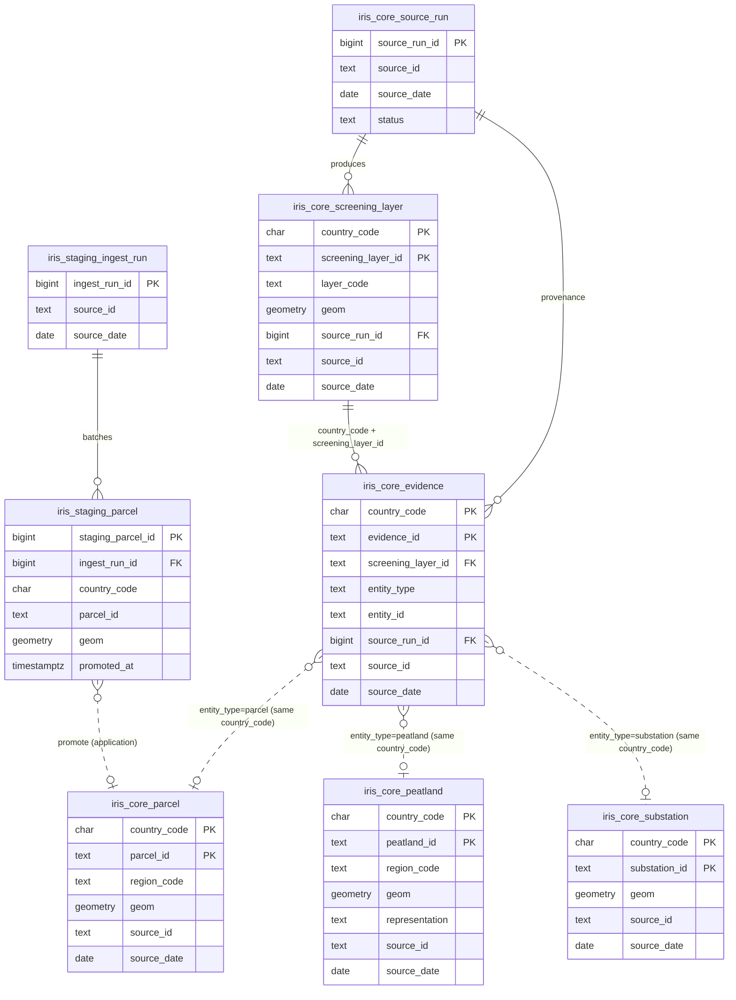

# IRIS database architecture

Country-scoped business entities use composite primary keys `(country_code, <entity_id>)`. `source_run` is global ingestion metadata (not country-scoped). Staged rows promote into `iris_core.parcel` without a database foreign key.

**Notes**

- `evidence` → `parcel` / `peatland` / `substation` is enforced by trigger (not a polymorphic FK); joins use `country_code` + `entity_id`.
- `screening_layer` → business entities use spatial predicates at query time; `evidence` stores explainability links.
- All `geom` columns are EPSG:4326 (`MultiPolygon` for area features, `Point` for substations).
